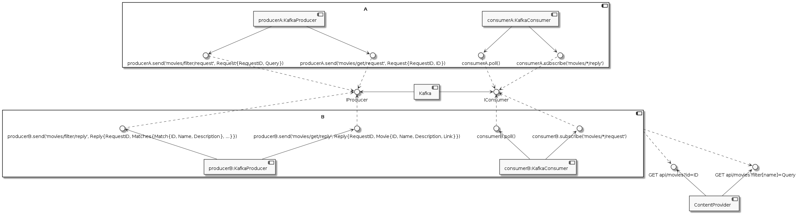
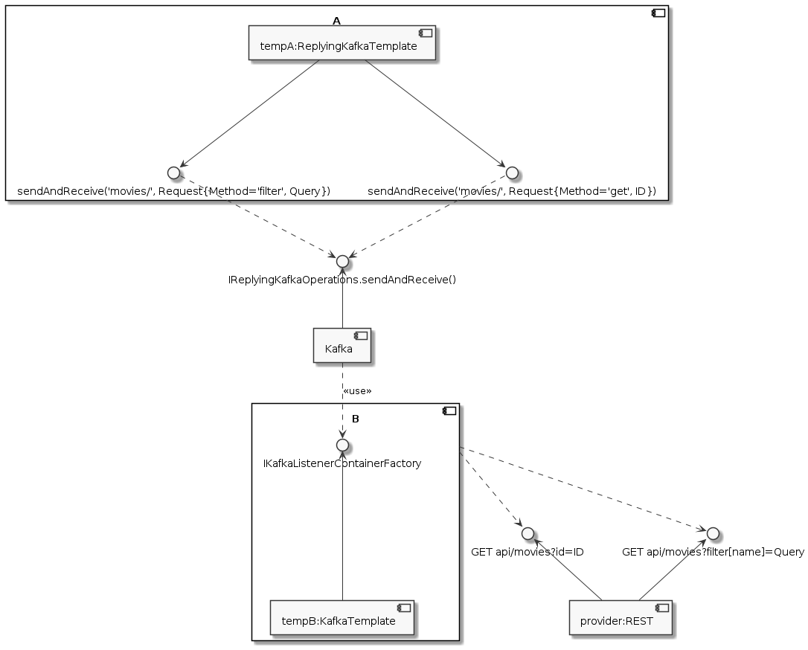

# Abstract

Онлайн кинотеатры предоставляют пользователям возможность искать и просматривать видеоконтент. Доступ к сервису кинотеатра производится через сервис В с пользовательского устройства, на котором запущен сервис А. Для реализации требуемой функциональности необходимо проработать API взаимодействия сервисов А, В и провайдера.

# Component Diagram

## Asynchronous Calls


## Syncronous Calls


# Provider REST API

## Endpoints

Для работы с фильмами провайдер предоставляет эндпойнт `movies` для GET запросов.

### Parameters

`filter` фильтр по фильмам принимает запрос на поиск  
`id` идентификатор фильма

### Provider API Replies

`GET /movies?filter[name]=query`
```json
{
  "links": {
    "self": "http://provider.com/movies?filter[name]=query"
  },
  "data": [
    {
      "id": 1,
      "name": "query1"
    },
    {
      "id": 14,
      "name": "query2"
    }
  ]
}
```

`GET /movies?id=id`
```json
{
  "links": {
    "self": "http://provider.com/movies?id=id"
  },
  "data": [
    {
      "type": "movies",
      "id": "id",
      "name": "MovieName",
      "link": "http://provider.com/store/movies/id"
    },
  ]
}
```

# A B Services Messages

Описание структуры сообщений представлено в формате yaml подмножества kaitai

## Filter

### Request
```yaml
meta:
  id: filter_request
  title: Filter movie request
seq:
  - id: call_id
    type: uuid
  - id: query
    type: str
    size-eos: true
```

## Reply
```yaml
meta:
  id: filter_reply
  title: Filter movie reply
seq:
  - id: call_id
    type: uuid
  - id: matches
    type: match
    repeat: eos
type:
  match:
    seq:
      - id: id
        type: uuid
      - id: name
        type: str
        size-eos: true
```

## Get

### Request
```yaml
meta:
  id: get_request
  title: Get movie request
seq:
  - id: call_id
    type: uuid
  - id: id
    type: uuid
```

## Reply
```yaml
meta:
  id: get_reply
  title: Get movie reply
seq:
  - id: call_id
    type: uuid
  - id: movie
    type: movie
type:
  movie:
    seq:
      - id: id
        type: uuid
      - id: name
        type: str
        size-eos: true
      - id: description
        type: str
        size-eos: true
      - id: link
        type: url
```

# Sequence Diagram

# Filter Movie


# Get Movie

